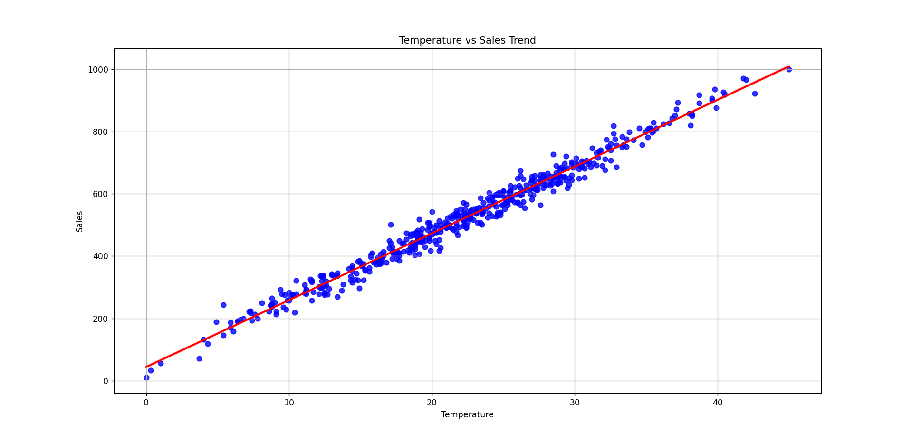
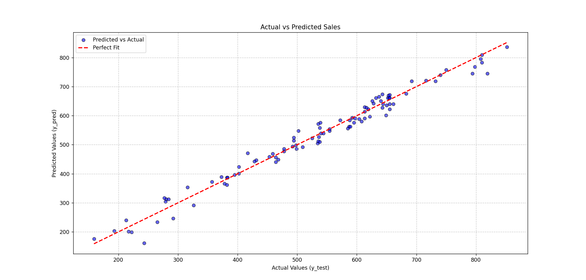

# 🍦 Ice Cream Sales Prediction using Machine Learning

## 📌 Project Overview

This project uses Machine Learning to predict **Ice Cream Sales based on Temperature**.

The project demonstrates a complete Machine Learning workflow including:

* Data Loading
* Data Cleaning
* Duplicate Removal
* Outlier Detection and Removal
* Exploratory Data Analysis
* Correlation Analysis
* Train-Test Split
* Linear Regression
* Model Evaluation
* Actual vs Predicted Visualization

---

## 📊 Dataset

The dataset contains two main features:

| Column      | Description       |
| ----------- | ----------------- |
| Temperature | Temperature value |
| Sales       | Ice Cream Sales   |

The original dataset contains **500 records**.

After removing duplicate and outlier records, **493 records** were used for model training and testing.

---

## 🛠️ Technologies Used

* Python
* Pandas
* NumPy
* Matplotlib
* Seaborn
* Scikit-learn
* Jupyter Notebook

---

## 🔍 Data Preprocessing

The following preprocessing steps were performed:

### 1. Duplicate Removal

Duplicate records were identified and removed from the dataset.

### 2. Outlier Detection

Box plots were used to inspect outliers in:

* Temperature
* Sales

### 3. Outlier Removal

The **IQR (Interquartile Range)** method was used to remove extreme values from the Temperature and Sales columns.

---

## 📈 Exploratory Data Analysis

A regression plot was created to understand the relationship between Temperature and Ice Cream Sales.

The analysis shows a strong positive relationship between temperature and sales.

### Temperature vs Sales



---

## 🔗 Correlation Analysis

The correlation between Temperature and Sales was approximately:

**0.9892**

This indicates a very strong positive relationship between the two variables.

---

## 🤖 Machine Learning Model

### Linear Regression

Linear Regression was selected because the project contains one numerical input feature:

**Temperature → Sales**

The dataset was divided using an **80/20 Train-Test Split**.

* Training Data: 394 records
* Testing Data: 99 records

---

## 📊 Model Performance

The Linear Regression model achieved the following results:

| Metric   |   Result |
| -------- | -------: |
| MAE      |  19.1240 |
| MSE      | 594.1172 |
| RMSE     |  24.3745 |
| R² Score |   0.9761 |

The **R² Score of 0.9761** indicates that the model explains a very high proportion of the variation in Sales for this dataset.

---

## 🎯 Sample Predictions

The trained model was used to predict sales for different temperatures.

### Temperature = 40

Predicted Ice Cream Sales:

**900.63**

### Temperature = 12

Predicted Ice Cream Sales:

**302.04**

---

## 📉 Actual vs Predicted

The following graph compares actual sales values with the model's predicted values.



The closer the points are to the **Perfect Fit** line, the closer the predictions are to the actual values.

---

## 📁 Project Structure

```text
Ice-Cream-Sales-Prediction/
│
├── Ice_Cream.csv
├── train.py
├── train.ipynb
├── Chart.png
└── README.md
└── Tempreature_vs_Sales.png
└── Actual_vs_Predicted.png
```

---

## ▶️ How to Run

### 1. Clone the repository

```bash
git clone https://github.com/your-username/Ice-Cream-Sales-Prediction.git
```

### 2. Open the project folder

```bash
cd Ice-Cream-Sales-Prediction
```

### 3. Install required libraries

```bash
pip install pandas numpy matplotlib seaborn scikit-learn
```

### 4. Run the Python file

```bash
python train.py
```

Or open:

```text
train.ipynb
```

in Jupyter Notebook / VS Code.

---

## 🚀 Future Improvements

Possible improvements for this project include:

* Testing additional Machine Learning algorithms
* Adding more features such as weather conditions, holidays, and location
* Creating a web interface for predictions
* Deploying the model as a web application

---

## 👨‍💻 Author

**Shyam Sitapara**

BCA (Artificial Intelligence) Student

---

⭐ If you find this project useful, feel free to explore the repository.
